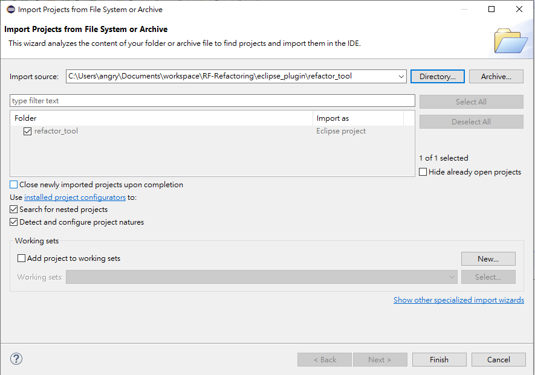

# RF Refactoring

## Outline

* [rfrefactoring package](#rfrefactoring-package)
* [Eclipse plugin](#eclipse-plugin)
---
## rfrefactoring package
1. Install robotframework,

    run the following command:
    > pip install robotframework==3.0.4
2. Use following command to run all tests.

    All tests should be passed.
    > python python_package/test/testRunner.py

## Eclipse plugin
1. Download the Eclipse from [here](https://www.eclipse.org/downloads/).

2. Install the `Eclipse Plug-in Development Environment(PDE)` feature in Eclipse.

3. Import the `refactor_tool` project into Eclipse

    

4. Install the `rfrefactoring` package

    Run the following command:
    > pip install JoeLiu-RF_Refactoring

5. Put the `jython-standalone-2.7.2b3.jar` into `rfrefactoring` folder 

6. Run the plugin

    Right click project -> `Run As` -> `Eclipse Application `

    

7. Set the `python site-package` location for the plugin

    7.1 Go to `Windows` -> `Preferences` -> `Robot Framework Refactoring`

    7.2 Set the `site-packages` path
    
            You should replace it to your path!!!

    

8. Restart the plugin and it should be able to refactoring.

9. Run the `unit tests` for plugin

    9.1 Open the `test/RefactorHelperTest.java`

    9.2 Replace the `pythonSite` variable with your site-package path
    

    9.3 Run `RefactorHelperTest` with junit

        All tests should be passed.
---
